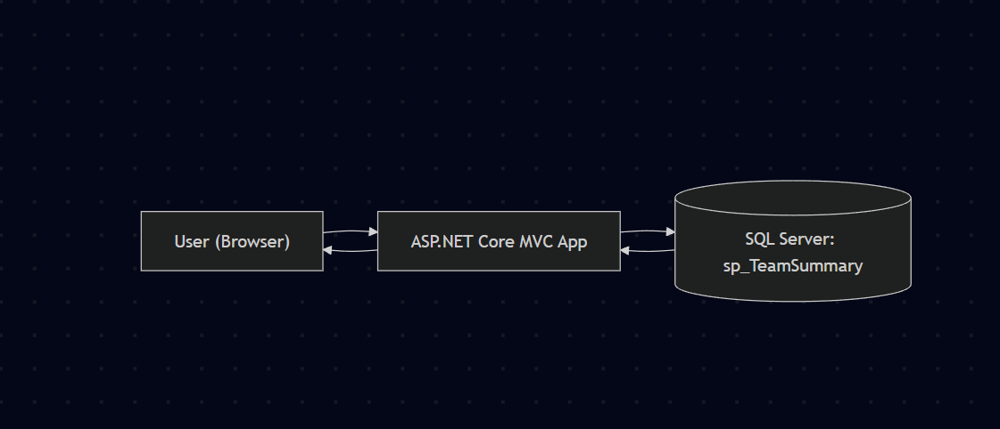

# NBA Team Summary

## Overview
ASP.NET Core MVC app that shows NBA team stats from a SQL Server stored procedure.

## Setup
1. Install **SQL Server Express** and **SQL Server Management Studio (SSMS)**.
2. Run `DBCreationScript.sql` in SSMS to create the database, tables, and seed data.
3. Run `sql/sp_TeamSummary.sql` in SSMS (or via `sqlcmd`) to create the stored procedure.
4. Update `appsettings.json` with your SQL Server connection string.
5. Run the app:
   ```bash
   dotnet run
   ```
   Open browser → navigate to the URL printed in the console

## Stored Procedure

The application depends on the stored procedure dbo.sp_TeamSummary.

- Location: `sql/sp_TeamSummary.sql`

Run it manually in SSMS or with sqlcmd:

`sqlcmd -S . -d NBA -E -i sql\sp_TeamSummary.sql`


This will (re)create `dbo.sp_TeamSummary` in your NBA database.

To verify it’s installed, run:

`EXEC dbo.sp_TeamSummary;`

## Notes

Data comes directly from dbo.sp_TeamSummary.

Chart toggles between Wins and Losses by clicking the Lost column header.


